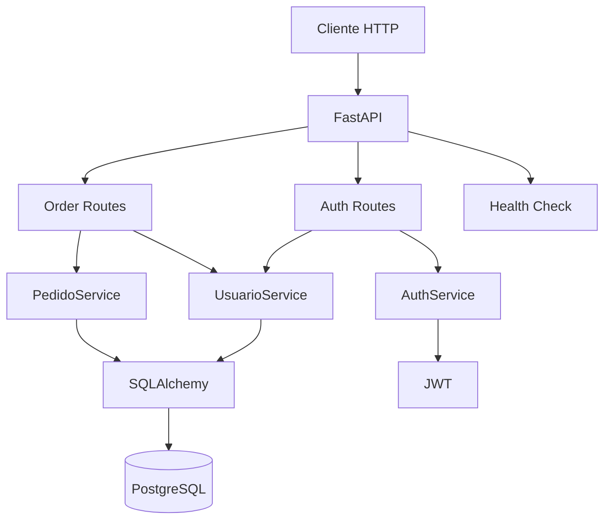

# DeliveryFastAPINew

API REST para gerenciamento de usuários e pedidos construída com **FastAPI**, **SQLAlchemy** e **PostgreSQL**.

A aplicação implementa autenticação JWT com access e refresh tokens, gerenciamento de pedidos e itens, controle de acesso administrativo, paginação, migrations com Alembic, testes automatizados e ambiente containerizado com Docker Compose.

## API em produção

A API está disponível em produção no Render. Acesse a documentação interativa pelo link:

[https://deliveryfastapinew.onrender.com/docs](https://deliveryfastapinew.onrender.com/docs)

## Funcionalidades

### Usuários e autenticação

* Criação de conta.
* Autenticação por e-mail e senha.
* Geração de access token JWT.
* Geração de refresh token JWT.
* Renovação de access e refresh tokens.
* Validação de usuários ativos.
* Proteção de rotas através de Bearer Token.
* Separação entre access tokens e refresh tokens.
* Senhas armazenadas utilizando hashing.

### Pedidos

* Criação de pedidos.
* Adição de itens ao pedido.
* Remoção de itens.
* Cálculo do valor do pedido.
* Finalização de pedidos.
* Cancelamento de pedidos.
* Consulta dos pedidos pertencentes ao usuário autenticado.
* Consulta paginada de todos os pedidos para usuários administradores.

### Infraestrutura

* PostgreSQL.
* SQLAlchemy ORM.
* Migrations com Alembic.
* Docker.
* Docker Compose.
* Health check da aplicação e do banco de dados.
* CI com GitHub Actions.
* Lint e format check com Ruff.
* Testes com pytest.
* Cobertura com pytest-cov.

## Tecnologias

| Categoria         | Tecnologia              |
| ----------------- | ----------------------- |
| Linguagem         | Python 3.12+            |
| Framework         | FastAPI                 |
| Servidor ASGI     | Uvicorn                 |
| Validação         | Pydantic                |
| Configuração      | Pydantic Settings       |
| ORM               | SQLAlchemy              |
| Banco de dados    | PostgreSQL              |
| Driver PostgreSQL | psycopg2                |
| Migrations        | Alembic                 |
| Autenticação      | OAuth2 + JWT            |
| JWT               | PyJWT                   |
| Senhas            | pwdlib                  |
| Dependências      | uv                      |
| Testes            | pytest                  |
| Cobertura         | pytest-cov              |
| Qualidade         | Ruff                    |
| Logging           | Loguru                  |
| Containers        | Docker / Docker Compose |
| CI                | GitHub Actions          |

## Arquitetura

O projeto utiliza uma separação em camadas entre rotas HTTP, serviços de aplicação e acesso ao banco através do SQLAlchemy.



Os routers são responsáveis pela camada HTTP, enquanto os services concentram autenticação e regras relacionadas a usuários e pedidos.

Não há uma camada Repository separada atualmente: os services utilizam diretamente a sessão SQLAlchemy.

## Estrutura do projeto

```text
.
├── .github/
│   └── workflows/
│
├── alembic/
│   ├── versions/
│   └── env.py
│
├── src/
│   ├── routes/
│   │   ├── auth.py
│   │   └── orders.py
│   │
│   ├── services/
│   │   ├── auth_service.py
│   │   ├── pedido_service.py
│   │   └── usuario_service.py
│   │
│   └── utils/
│       ├── exceptions.py
│       └── senha.py
│
├── tests/
│   ├── src/
│   └── conftest.py
│
├── database.py
├── dependencies.py
├── main.py
├── models.py
├── schemas.py
├── settings.py
├── alembic.ini
├── Dockerfile
├── docker-compose.yml
├── pyproject.toml
└── uv.lock
```

### Componentes principais

`main.py`
: Inicializa a aplicação FastAPI, registra os routers e expõe o health check.

`src/routes/`
: Define os endpoints HTTP de autenticação e pedidos.

`src/services/`
: Contém regras de autenticação, usuários e pedidos.

`models.py`
: Define as entidades SQLAlchemy utilizadas pela aplicação.

`schemas.py`
: Define os modelos Pydantic utilizados nas requisições e respostas.

`database.py`
: Configura a engine SQLAlchemy, sessões e dependência de banco de dados.

`settings.py`
: Carrega as configurações através de variáveis de ambiente.

`alembic/`
: Contém a configuração e as migrations do banco.

`tests/`
: Contém testes de routes, services e utilitários.

## Modelo de dados

A aplicação possui três entidades principais.

### Usuario

Representa um usuário da aplicação.

Principais campos:

* `id`
* `nome`
* `email`
* `senha`
* `ativo`
* `admin`

Nome e e-mail possuem restrição de unicidade.

### Pedido

Representa um pedido pertencente a um usuário.

Principais campos:

* `id`
* `status`
* `usuario`
* `preco`

Um pedido pode possuir múltiplos itens.

### ItensPedido

Representa um item pertencente a um pedido.

Principais campos:

* `id`
* `quantidade`
* `sabor`
* `tamanho`
* `preco_unitario`
* `pedido`

A relação entre pedido e itens utiliza cascade para remoção dos itens associados.

## Pré-requisitos

Para executar localmente:

* Python `>= 3.12.13`
* `uv`
* PostgreSQL

Alternativamente, o banco e a aplicação podem ser executados com:

* Docker
* Docker Compose

## Instalação das dependências

Na raiz do projeto:

```bash
uv sync
```

O projeto utiliza `uv.lock`, permitindo instalar as versões resolvidas das dependências.

## Configuração

A aplicação utiliza `pydantic-settings` e carrega automaticamente variáveis de um arquivo `.env`.

Crie o arquivo a partir do `.env.example`.

Linux/macOS:

```bash
cp .env.example .env
```

PowerShell:

```powershell
Copy-Item .env.example .env
```

Nunca versione o `.env`.

## Variáveis de ambiente

### Aplicação

| Variável                      | Descrição                                | Obrigatória | Padrão  |
| ----------------------------- | ---------------------------------------- | ----------: | ------- |
| `DATABASE_URL`                | String de conexão SQLAlchemy             |         Sim | —       |
| `SECRET_KEY`                  | Chave utilizada para assinatura dos JWTs |         Sim | —       |
| `ALGORITHM`                   | Algoritmo utilizado nos JWTs             |         Não | `HS256` |
| `ACCESS_TOKEN_EXPIRE_MINUTES` | Expiração do access token em minutos     |         Não | `30`    |
| `REFRESH_TOKEN_EXPIRE_DAYS`   | Expiração do refresh token em dias       |         Não | `3`     |

Exemplo para execução local:

```dotenv
DATABASE_URL=postgresql+psycopg2://<usuario>:<senha>@localhost:5432/<banco>
SECRET_KEY=<chave-secreta-forte>
ALGORITHM=HS256
ACCESS_TOKEN_EXPIRE_MINUTES=30
REFRESH_TOKEN_EXPIRE_DAYS=3
```

Não utilize valores de exemplo como credenciais de produção.

### Docker Compose

O `docker-compose.yml` constrói o `DATABASE_URL` internamente e utiliza também:

| Variável                      | Descrição              |
| ----------------------------- | ---------------------- |
| `DB_USER`                     | Usuário do PostgreSQL  |
| `DB_PASSWORD`                 | Senha do PostgreSQL    |
| `DB_NAME`                     | Nome do banco          |
| `SECRET_KEY`                  | Chave JWT              |
| `ALGORITHM`                   | Algoritmo JWT          |
| `ACCESS_TOKEN_EXPIRE_MINUTES` | Tempo do access token  |
| `REFRESH_TOKEN_EXPIRE_DAYS`   | Tempo do refresh token |

Exemplo:

```dotenv
DB_USER=<usuario>
DB_PASSWORD=<senha>
DB_NAME=<banco>

SECRET_KEY=<chave-secreta-forte>
ALGORITHM=HS256
ACCESS_TOKEN_EXPIRE_MINUTES=30
REFRESH_TOKEN_EXPIRE_DAYS=3
```

## Executando localmente

Com PostgreSQL disponível e o `.env` configurado, aplique primeiro as migrations:

```bash
uv run alembic upgrade head
```

Depois inicie a API:

```bash
uv run uvicorn main:app --host 0.0.0.0 --port 8000
```

## Executando com Docker

Configure as variáveis necessárias no `.env` e execute:

```bash
docker compose up --build
```

O Compose inicia dois serviços:

```text
PostgreSQL
    ↓
health check
    ↓
Alembic migrations
    ↓
FastAPI / Uvicorn
```

A API é exposta na porta:

```text
8000
```

O PostgreSQL é exposto na porta:

```text
5432
```

Antes de iniciar o servidor, o container da aplicação executa automaticamente:

```bash
uv run alembic upgrade head
```

Em seguida:

```bash
uv run uvicorn main:app --host 0.0.0.0 --port 8000
```

Para encerrar os containers:

```bash
docker compose down
```

## Banco de dados e migrations

A aplicação utiliza PostgreSQL com SQLAlchemy.

As migrations são gerenciadas pelo Alembic.

Para atualizar o banco para a migration mais recente:

```bash
uv run alembic upgrade head
```

No ambiente Docker Compose esse comando já faz parte da inicialização da aplicação.

## API

### Health Check

| Método | Endpoint  | Autenticação | Descrição                                    |
| ------ | --------- | -----------: | -------------------------------------------- |
| `GET`  | `/health` |          Não | Verifica a aplicação e a conexão com o banco |

O health check retorna também a latência da consulta ao banco de dados.

### Autenticação

Prefixo:

```text
/auth
```

| Método | Endpoint            |  Autenticação | Descrição                                 |
| ------ | ------------------- | ------------: | ----------------------------------------- |
| `POST` | `/auth/criar-conta` |           Não | Cria um usuário                           |
| `POST` | `/auth/login-form`  |           Não | Autentica e retorna access/refresh tokens |
| `POST` | `/auth/refresh`     | Refresh token | Renova os tokens                          |

### Cadastro

O cadastro recebe dados equivalentes a:

```json
{
  "nome": "Usuario",
  "email": "usuario@example.com",
  "senha": "senha-segura"
}
```

O usuário criado pelo endpoint público não recebe privilégios administrativos.

### Login

O login utiliza `OAuth2PasswordRequestForm`.

Por isso, a requisição utiliza form data.

O campo OAuth2 chamado `username` deve conter o **e-mail do usuário**:

```text
username=usuario@example.com
password=<senha>
```

A resposta contém:

```json
{
  "access_token": "<access-token>",
  "refresh_token": "<refresh-token>",
  "token_type": "Bearer"
}
```

### Autorização

Rotas protegidas esperam:

```http
Authorization: Bearer <access-token>
```

Os access tokens são destinados às rotas protegidas.

Refresh tokens são aceitos pelo fluxo de renovação de tokens.

### Pedidos

Prefixo:

```text
/pedidos
```

Os endpoints de pedidos exigem usuário autenticado.

| Método   | Endpoint                                  | Descrição                            |
| -------- | ----------------------------------------- | ------------------------------------ |
| `POST`   | `/pedidos/criar`                          | Cria um pedido                       |
| `POST`   | `/pedidos/{id_pedido}/adicionar-item`     | Adiciona item ao pedido              |
| `DELETE` | `/pedidos/{id_item_pedido}/remover-item/` | Remove um item                       |
| `PUT`    | `/pedidos/{id_pedido}/finalizar/`         | Finaliza o pedido                    |
| `PUT`    | `/pedidos/{id_pedido}/cancelar/`          | Cancela o pedido                     |
| `GET`    | `/pedidos/listar`                         | Lista pedidos de forma paginada      |
| `GET`    | `/pedidos/listar/pedido-usuario`          | Lista pedidos do usuário autenticado |

A listagem geral de pedidos exige usuário administrador.

### Paginação

A listagem administrativa utiliza:

```text
offset
limit
```

O valor padrão de `limit` é `5` e o máximo permitido pelo schema é `50`.

## Documentação da API

Como a aplicação utiliza a configuração padrão do FastAPI, a documentação interativa fica disponível em:

```text
/docs
```

e:

```text
/redoc
```

## Testes

Os testes utilizam pytest.

A estrutura atual contém testes para:

```text
routes
services
utils
```

As fixtures de teste configuram um banco SQLite separado do PostgreSQL utilizado pelo ambiente Docker.

Execute:

```bash
uv run pytest
```

A configuração do projeto já habilita cobertura do package `src` e geração de relatório HTML.

Para aplicar também o mesmo limite mínimo utilizado no CI:

```bash
uv run pytest --cov-fail-under=80
```

Após a execução com cobertura, o relatório HTML é gerado pelo pytest-cov conforme a configuração presente no `pyproject.toml`.

## Qualidade de código

O projeto utiliza Ruff.

Validar formatação:

```bash
uv run ruff format --check .
```

Executar lint:

```bash
uv run ruff check .
```

## CI

O repositório possui GitHub Actions configurado para `push` e `pull_request` direcionados à branch `main`.

O pipeline executa aproximadamente:

```text
Push / Pull Request
        ↓
Python 3.12.13
        ↓
Setup uv
        ↓
uv sync
        ↓
Ruff format check
        ↓
Ruff lint
        ↓
pytest + coverage
        ↓
Coverage >= 80%
```

Atualmente o workflow cobre integração contínua de qualidade e testes.

Não há estágio de deployment configurado nesse workflow.

## Health Check

A aplicação expõe:

```text
GET /health
```

O endpoint executa uma consulta ao banco e retorna o estado da aplicação junto à latência da operação.

Isso permite que plataformas de execução e sistemas de monitoramento verifiquem não apenas o processo HTTP, mas também a disponibilidade da conexão com o banco.

## Estado atual

O projeto possui atualmente:

* autenticação JWT;
* access e refresh tokens;
* autorização de rotas;
* usuários administrativos;
* gerenciamento de pedidos;
* PostgreSQL;
* SQLAlchemy;
* Alembic;
* validação com Pydantic;
* testes automatizados;
* cobertura;
* Ruff;
* Docker;
* Docker Compose;
* health check;
* GitHub Actions.

O repositório ainda não possui um fluxo de deployment configurado no GitHub Actions.

## Contribuição

Antes de enviar alterações, execute:

```bash
uv run ruff format --check .
uv run ruff check .
uv run pytest --cov-fail-under=80
```

Mantenha migrations do banco compatíveis com as alterações realizadas nos models.

## Licença

Não foi identificado um arquivo de licença no estado atual do repositório.

Caso o projeto seja distribuído ou publicado para reutilização por terceiros, uma licença deve ser definida explicitamente.
